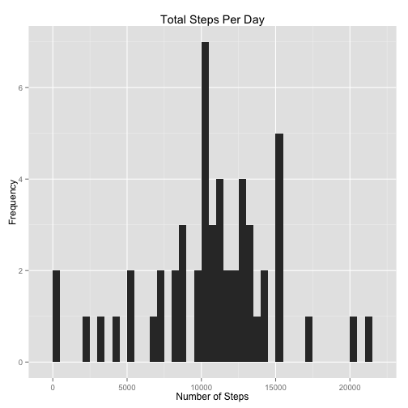
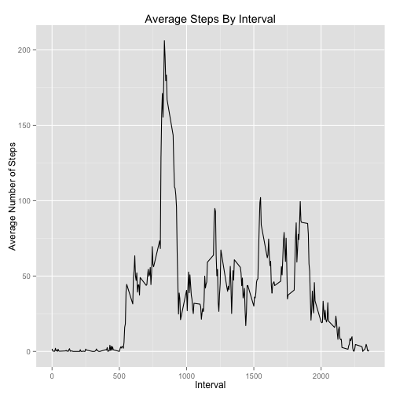
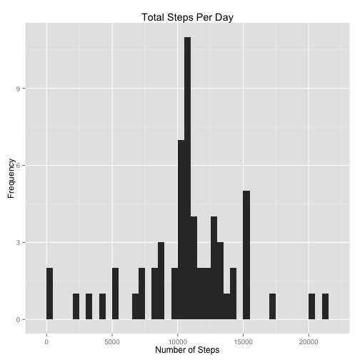
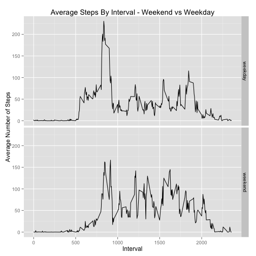

## Loading and preprocessing the data

Throughout our analysis, we assume the packages 'dplyr' and 'ggplot2' have both been loaded . After downloading the file activity.zip, we store the data into a data frame: 

```r
unzip('activity.zip')
data <- read.csv('activity.csv')
```

Before analyzing the data, we construct an additional data frame by removing all rows that contain missing values:  

```r
dataGood <- filter(data, !is.na(steps))
```

## What is mean total number of steps taken per day?
- Using the data frame that omits missing values, we create a histogram of the total number of steps taken each day: 

```r
ByDate <- group_by(dataGood, date)
stepsByDate <- summarize(ByDate, numSteps=sum(steps))
ggplot(stepsByDate, aes(x=numSteps)) + geom_bar(binwidth = 500) + 
        xlab("Number of Steps") + ylab("Frequency") + ggtitle("Total Steps Per Day") 
```

 
  
- We also report the mean and median total number of steps taken per day:

```r
mean(stepsByDate$numSteps)
```

```
## [1] 10766.19
```

```r
median(stepsByDate$numSteps)
```

```
## [1] 10765
```

## What is the average daily activity pattern?
- Again using the data frame that omits missing values, we make a time series plot of the 5-minute intervals and the average number of steps taken in each interval (averaged across all days):

```r
ByInt <- group_by(dataGood, interval)
stepsByInt <- summarize(ByInt, aveSteps = mean(steps))
ggplot(stepsByInt, aes(x=interval, y=aveSteps)) + geom_line(type = 'l') + 
  xlab('Interval') + ylab('Average Number of Steps') + ggtitle("Average Steps By Interval")
```

 

- On average across all the days in the dataset, we observe that the interval 835 contains the maximum number of steps:

```r
filter(stepsByInt, aveSteps==max(aveSteps))$interval
```

```
## [1] 835
```


## Imputing missing values
- We observe that there are 2,304 total observations in the dataset that have missing values:

```r
nrow(data) - nrow(dataGood)
```

```
## [1] 2304
```

- To fill in the missing data, we decide to replace each missing value with the average number of steps recorded for the corresponding interval.

- Armed with the averages computed above, this new dataset is easily created as follows:

```r
dataFixed <- merge(data, stepsByInt)
badRows <- is.na(dataFixed$steps)
dataFixed[badRows,'steps'] <- dataFixed[badRows, 'aveSteps']
```

- Using this new dataset instead, we again make a histogram of the total number of steps taken each day: 

```r
ByDateFixed <- group_by(dataFixed, date)
stepsByDateFixed <- summarize(ByDateFixed, numSteps=sum(steps))
ggplot(stepsByDateFixed, aes(x=numSteps)) + geom_bar(binwidth = 500) + 
   xlab("Number of Steps") + ylab("Frequency") + ggtitle("Total Steps Per Day")
```

 

The new mean and median total number of steps taken per day are calculated: 

```r
mean(stepsByDateFixed$numSteps)
```

```
## [1] 10766.19
```

```r
median(stepsByDateFixed$numSteps)
```

```
## [1] 10766.19
```
We observe that these calculations are very close to our earlier calculations, which were made simply by ignoring observations with missing values. Although imputing missing data must increase each estimate of total daily number of steps, we conclude that it had a relatively small impact overall. 


## Are there differences in activity patterns between weekdays and weekends?
- Using the dataset that was creating by estimating missing values, we add a variable indicating if each day is a weekday or weekend day: 

```r
dayType <- as.factor(weekdays(strptime(dataFixed$date, format = '%Y-%m-%d')) %in% c('Saturday', 'Sunday'))
levels(dayType) <- c('weekday', 'weekend')
dataFixed <- mutate(dataFixed, dayType = dayType)
```

- Finally, we make a panel plot containing a time series plot of the 5-minute interval  and the average number of steps taken, where the average is computed across all weekday days or weekend days.

```r
ByDayAndInt <- group_by(dataFixed, dayType, interval)
stepsByDayAndInt <- summarize(ByDayAndInt, aveSteps = mean(steps))
ggplot(stepsByDayAndInt, aes(x=interval, y=aveSteps)) + geom_line(type = 'l') + facet_grid(dayType~.) +
  xlab('Interval') + ylab('Average Number of Steps') + ggtitle("Average Steps By Interval - Weekend vs Weekday")
```

 
